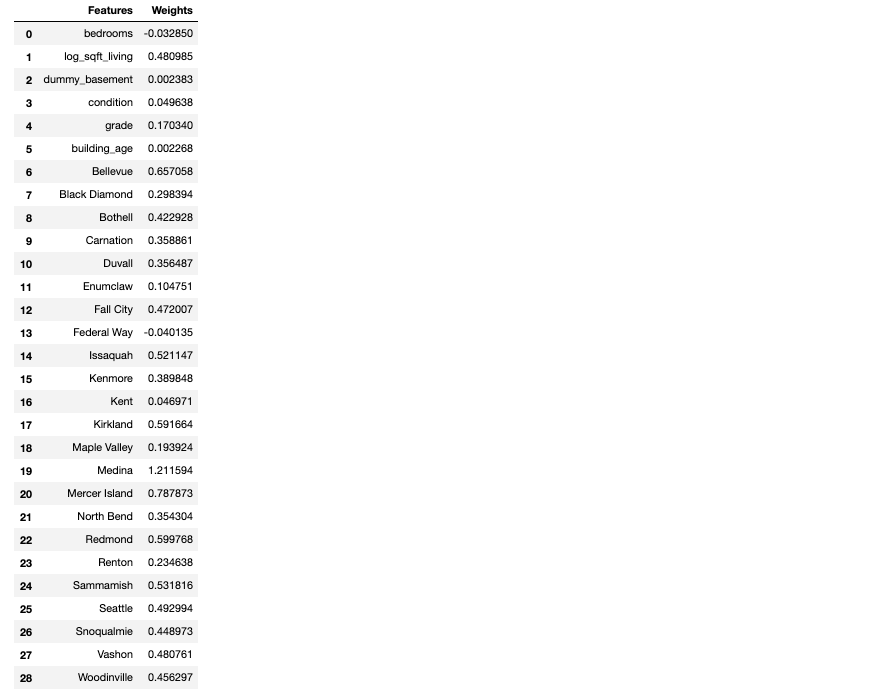

# Statistical_Analysis_Multiple_Linear_Regression
##
The goal of this project is to forecast the housing price of King County.
The data is from [Kaggle.com](https://www.kaggle.com/shivachandel/kc-house-data/tasks).
## File from Kaggle and more information
Online property companies offer valuations of houses using machine learning techniques. The aim of this report is to predict the house sales in King County, Washington State, USA using Multiple Linear Regression (MLR). The dataset consisted of historic data of houses sold between May 2014 to May 2015.
We will predict the sales of houses in King County with an accuracy of at least 75-80% and understand which factors are responsible for higher property value - $650K and above.”

The dataset consists of house prices from King County an area in the US State of Washington, this data also covers Seattle. The dataset was obtained from Kaggle. This data was published/released under CC0: Public Domain. Unfortunately, the user has not indicated the source of the data. Please find the citation and database description in the Glossary and Bibliography.
The dataset consisted of 21 variables and 21613 observations.
## Data Cleaning & EDA
In this section, some important features were selected for analyzing based on the feature information. For example, the square feet of the house and the numbers of the house. Obviously, normally the bigger size the house is, the more room there might be, and one variable can partially explain another one. So in order to avoid multicollinearity, I selected variables that can explain the independent variables well.

### The changes housing price by time

We can see that the mean of the price is stable and there is one big fluctuation between 2014 09 29  to 2014 11 18.
In order to add up dummy variable, the zip codes were converted into city names using uszipcode library, then convert those cities into dummy variable.
###  Distribution of features and feature Engieering
####  Distribution of Features & Outlier Removel  - Before

####  Distribution of Features & Outlier Removel - After

### More EDA
#### Price VS Bedroom

#### Price VS sqft_living - Linearity and Homoskedasticity

#### Basement VS Price 

#### Condition vs Price 

####  Grade vs Price

#### Building   Age VS Price

#### Cities VS Price (Map)

#### Cities VS Price (Mean, Barchart)

## Data Preprocessing & Feature Engieering
In this part, the library train_test_split was imported from sklearn.model_selection to split the train and test data. Selected features are based on correlation between features, then merged with dummy variables (cities).

## Linear Regression
###
In modeling part, Linear Regression was applied to predict the housing price in King County. The following list shows the coefficients of all variables - 

We can see that most coefficients are positive and only two of them are negative.
If the features' coefficients are positive that means the features can positively affect housing price. However, there is more important sector we need to know which is called p-value. P-value is part of statistical analysis using hypothesis test. If p-values smaller and equal to 0.05, then the features will significantly affect the independent variables, and we can see all features' p-values are significantly smaller than 0.05. 

###
After obtained the predicted values, the first thing we need to do is to see the distribution of our residuals. The images below are the residuals of train and test datasets. Also we can take a look at the results - to see how good our model is -  if the scatter plot for actual values and predicted values shows 45 degree trend, that means our model is good enough, because 45 degree means the slope is 1 which implies that our predicted values converge to actual values.

